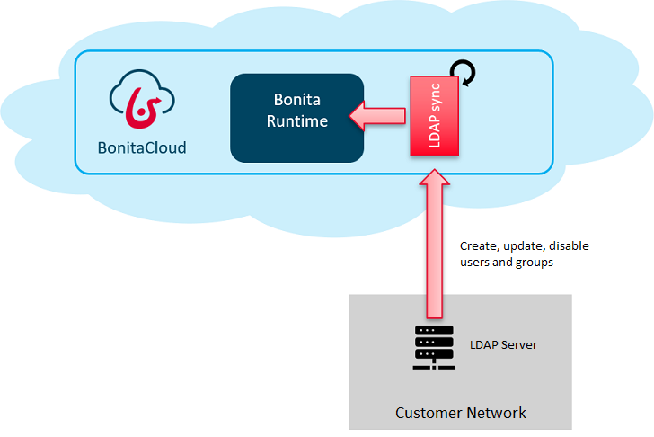

#Synchronize your organization groups and users

To avoid managing users in both Bonita and your authentification system, you can request the setup of a LDAP synchronizer in Bonita Cloud.

The LDAP synchronization service keeps the Bonita BPM organization information synchronized with an external LDAP directory, by creating, updating, or removing users and groups in the organization to match as closely as possible the user list attributes defined in LDAP. It does not modify the LDAP directory.

## Requesting a LDAP Synchronizer Integration
Create a new support case to request a LDAP Synchronization with Bonita Cloud. Make sure to provide the following information in your case:
* Your LDAP server URL
* The Runtime to synchronize
* LDAP authentication type(supported values: none, simple or strong)
* Distinguished name(DN) of the user account used for browsing through the LDAP users
* Type of the user object("user" for an Active Directory, "person" for an LDAP)
* The desired synchronization frequency
