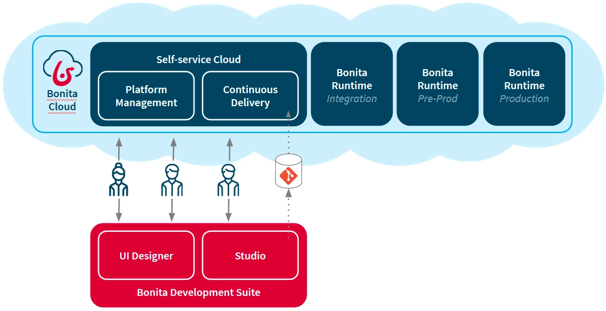

# Bonita Cloud
From our business intelligence service to your mission-critical Living Apps, Bonita Cloud makes it easy to deploy, operate, and scale in the cloud.

Bonita Cloud initial offer includes:
* In our cloud:
  * 3 runtimes: One production and Two non-productions
  * Access to Bonita Cloud self-serving which consist of:
    * The Continuous delivery service
    * The platform manager
* High Availability and High Performance
* Up to 10 Studio licenses
* Support: Gold elite or platinium
* Unlimited processes, cases, tasks, forms and applications

## Service Regions
Bonita Cloud is currently available in Europe and North America:

| North America | Europe         |
| ------------- | -------------- |
| Canada        | Ireland        |
| United States | United Kingdom |
|               | France         |
|               | Germany        |

> The infrastructure country does not imply that Bonitasoft technical support will be located in the same country

> The legal jurisdiction of the infrastructure's country is applied   It is the customer's responsibility to make sure they meet the legal requirements of the country.
